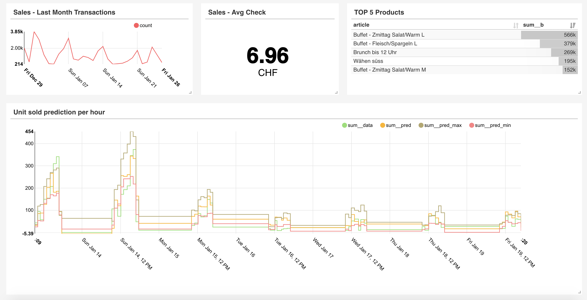
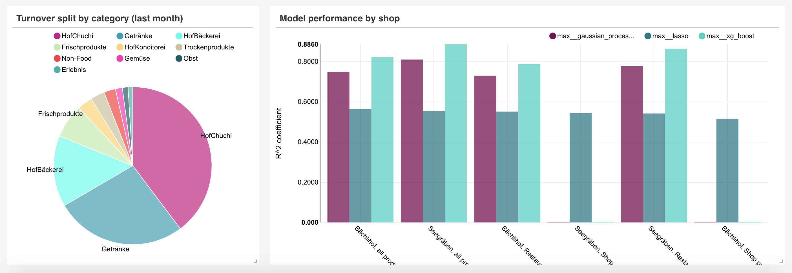

# A Dashboard for Prognolite

## Abstract

In the food hackathon we (@arnaudmiribel - @victor5114 - @jastaehl - @yamash - @ArnaudRobert - @musella - @Ash-1331 - @alafanechere)
helped Prognolite to prototype 3 data driven use cases for their clients :
1. Turnover forecasting to predict restaurant activities for better handling of food waste, staff management and customer services.
2. Bundling suggestions generated from receipt collection.
3. Realtime restaurant audience measurement by probe requests capture. Enabling covers estimation and forecast.

Our deliverable is a web app that displays data visualisations helping the restaurant staff to take decisions thanks to the three use-cases tackled.

## Repo organization

The repository is structured as :
* **bundling**: ML notebooks for product bundling from receipts
* **dashboard**: Docker configurations to run a [Superset](https://github.com/apache/incubator-superset) dashboard
* **data_ingestion**: Utils for ingesting csv into db
* **forecasts**: ML notebooks for unit and turnover forecasting
* **wifi_tracking**: Probe requests capture for wifi tracking

Temporary link to dashboard: http://lafanechere.me:8088

Some screenshots :

Credentials :
* Username : `demo`
* Password:  `demo75`

Link to forecasts outputs : https://cernbox.cern.ch/index.php/s/Rr8tSBtwvf679C1?path=%2F

## Details on our methods

* __Turnover Forecasting__

After aggregating the training data into per-hour frames, we decided to learn three models :
- one that predicts the number of products that will be sold
- one that predicts the number of clients visiting the shop
- one that predicts how much money will be earned.

For this, we tried three models of increasing complexity : Lasso Regression, Gaussian Process Regression and finally XGBoost Regression. The predictions and evaluations of the models are displayed in the dashboard.

* __Bundle Suggestions__  

We wanted to help the farm finding products that could be sold together. For this, we studied the historical data which consists of all the past baskets sold over last year.  We applied a clustering algorithm (LDA) that seeks for latent communities inside this basket set e.g. try to find the « I’m on my way to work, just taking a take-away breakfast » basket community for example. We looked for 20 communities of baskets; such that now, when the restaurant wants to create bundles, we look inside the communities where the products have the highest weight, and extract good product candidates that could be sold with them.

* __Real-time restaurant audience measurement__

Knowing how many customers visit the restaurant and how much time they spend inside is crucial to determine the visitors/tables turnover in order to optimise the amount of workfore and space for the restaurant owners. To evaluate this, we take advantage of the fact that all connected devices send Wi-Fi signals (called probe requests) by listening to them and counting them. That gives us a live approximation of the traffic in the restaurant, that we display on our dashboard.
